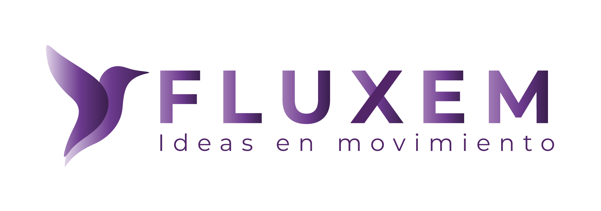

# Repositorio de Imágenes y Assets de Fluxem

<div align="center">
  
  <h3>Repositorio Oficial de Assets para Proyectos Fluxem</h3>
  <p>Almacenamiento centralizado de imágenes, logos, iconos y assets digitales utilizados en el ecosistema Fluxem</p>
</div>

---

## 📋 Descripción General

Este repositorio sirve como el centro centralizado para todos los assets visuales, imágenes, logos y materiales de marca utilizados en el ecosistema Fluxem. Proporciona una forma consistente y organizada de acceder y gestionar assets digitales para todos nuestros proyectos.

## 📁 Estructura del Repositorio

```
fluxem-images/
├── fluxem/                 # Assets de marca Fluxem
│   └── fluxem-icon.png    # Logo/icono principal de Fluxem
├── kiaro/                 # Assets del proyecto Kiaro
│   ├── logo-kiaro.png     # Logo de Kiaro (estándar)
│   └── logo-kiaro-white.png # Logo de Kiaro (variante blanca)
├── estyma-icon.png        # Icono del proyecto Estyma
└── [otros-proyectos]/     # Assets de proyectos futuros
```

## 🎨 Categorías de Assets

- **Logos de Marca**: Logos principales e identidades de marca
- **Iconos**: Iconos de aplicaciones, favicons y elementos de UI
- **Material de Marketing**: Banners, fondos y assets promocionales
- **Assets de Proyectos**: Assets específicos para proyectos individuales

## 📖 Guías de Uso

### Para Desarrolladores
```bash
# Clonar el repositorio para desarrollo local
git clone https://github.com/fluxem-sas/fluxem-images.git

# Acceder a assets vía URLs raw de GitHub en tus proyectos
https://raw.githubusercontent.com/fluxem-sas/fluxem-images/main/[ruta-al-asset]
```

### Para Diseñadores
1. **Agregar nuevos assets**: Crear un PR con assets debidamente organizados
2. **Convención de nomenclatura**: Usar nombres descriptivos, en minúsculas con guiones
3. **Formatos de archivo**: Preferir PNG para logos, SVG para iconos cuando sea posible
4. **Optimización**: Asegurar que las imágenes estén optimizadas para web

## 🔄 Contribuir

¡Damos la bienvenida a contribuciones para mejorar nuestra biblioteca de assets! Por favor:

1. **Haz Fork** de este repositorio
2. **Crea** una rama de funcionalidad (`git checkout -b feature/nuevos-assets`)
3. **Agrega** tus assets siguiendo nuestra estructura y convenciones de nomenclatura
4. **Haz Commit** de tus cambios (`git commit -m 'Agregar assets de nuevo proyecto'`)
5. **Haz Push** a la rama (`git push origin feature/nuevos-assets`)
6. **Abre** un Pull Request

### Requisitos de Assets
- **Calidad**: Assets de alta resolución adecuados para varios casos de uso
- **Formato**: PNG para imágenes complejas, SVG para gráficos/iconos simples
- **Tamaño**: Tamaños de archivo razonables (optimizar cuando sea posible)
- **Licencia**: Asegurar que tienes los derechos para contribuir con los assets

## 📄 Licencia

Este proyecto está licenciado bajo la Licencia MIT - consulta el archivo [LICENSE](LICENSE) para más detalles.

## 🏢 Acerca de Fluxem

Fluxem está comprometida con crear soluciones innovadoras y mantener altos estándares en todos nuestros proyectos. Este repositorio es parte de nuestro esfuerzo para mantener consistencia y accesibilidad en nuestro ecosistema digital.

## 📞 Contacto

- **Sitio Web**: [fluxem.com](https://fluxem.com)
- **Issues**: [GitHub Issues](https://github.com/fluxem-sas/fluxem-images/issues)
- **Email**: contact@fluxem.com

---

<div align="center">
  <p>Hecho con ❤️ por el Equipo Fluxem</p>
</div>
